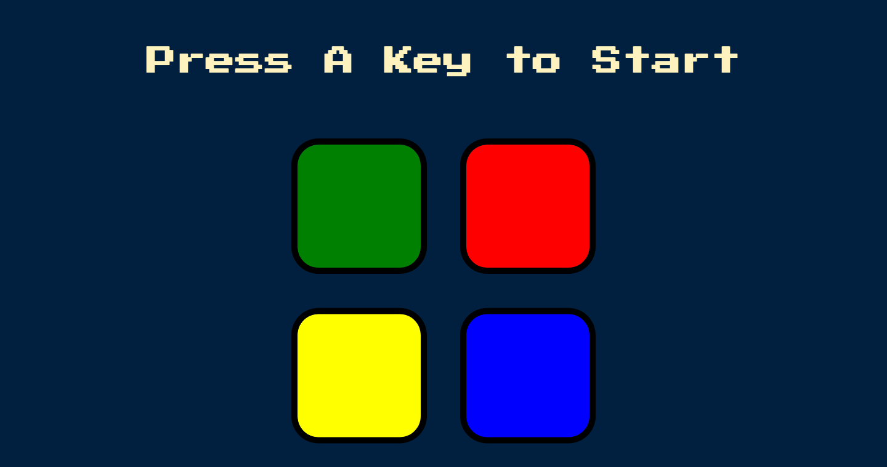

# Table of contents

- [Overview](#overview)
  - [Features](#features)
  - [Screenshot](#screenshot)
  - [Links](#links)
- [My process](#my-process)
  - [Built with](#built-with)
- [Author](#author)

## Overview

### Features

Users are be able to:

- Start/Restart the game
- Hear sound effects by clicking different buttons
- Game ends if the player gets the order of the colors wrong

### Screenshot

### Links

- Live Site URL: [https://mw3981.github.io/SimonGame/]

## My process

### Built with

- Semantic HTML
- CSS
- JavaScript
- jQuery

# Author

- Michelle Wong [https://michellewong.me]
